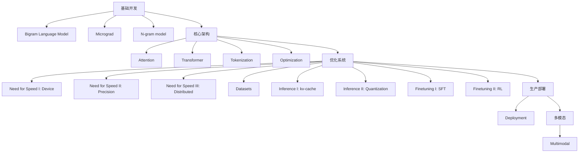

  <h1>🚀 LLM-101-Bootcamp: 从零构建生成式AI全栈指南</h1>
  
  
LLM-AI工程师成长训练营 | 分阶段多模块掌握LLM开发全流程

  

    
    
    
    
  

---

# 🌟 **项目背景与说明**

## 🎯 **项目动机**

本项目受到 **[karpathy/LLM101n](https://github.com/karpathy/LLM101n)** 项目的启发。尽管该项目的仓库已归档，且仅提供了大纲，但为了满足学习和探索的需求，我们决定对该项目进行完善和补充。我们的目标是构建一个功能齐全的**故事创作精灵 AI 🌟**，从基础到高级的深度学习技术进行全面的学习和实践。

## 🙏 **致敬 Richard Feynman**

在此项目中，我们特别致敬物理学家 Richard Feynman，其名言“**What I cannot create, I do not understand**”激励我们深入学习和实践。我们将通过构建和优化 AI 模型，努力达到这一境界。

# 🌟 项目全景

## 🚨 重要通知

本仓库正在积极建设中...

- [ ] ...
- [x] 构建并上传第一版内容 - 2025.04.01

## 📚 课程体系全景图

### 📖知识体系

## 💡**主要内容**

| 阶段         | 模块 | 技术主题                                                     | 核心组件                                       | 产出目标       | 难度 | 状态     | 代码示例 |
| ------------ | ---- | ------------------------------------------------------------ | ---------------------------------------------- | -------------- | ---- | -------- | -------- |
| **基础开发** | 01   | [Bigram Language Model](./source/chapters/01_bigram/chapter01_bigram_language_model.md) | Bigram/概率统计                                | 文本生成器     | ⭐    | 🚧 开发中 | -        |
|              | 02   | [Micrograd](./source/chapters/02_micrograd/chapter02_micrograd.md) | 反向传播/计算图                                | Micrograd框架  | ⭐⭐   | 🚧 开发中 | -        |
|              | 03   | [N-gram model](./source/chapters/03_ngram_model/chapter03_ngram_model.md) | MLP/矩阵优化                                   | 特征提取器     | ⭐⭐   | 🚧 开发中 | -        |
| **核心架构** | 04   | [Attention](./source/chapters/04_attention/chapter04_attention_model.md) | QKV计算/位置编码                               | Attention模块  | ⭐⭐⭐  | 🚧 开发中 | -        |
|              | 05   | [Transformer](./source/chapters/05_transformer/chapter05_transformer.md) | 残差连接/LayerNorm                             | GPT-2实现      | ⭐⭐⭐⭐ | 🚧 开发中 | -        |
|              | 06   | [Tokenization](./source/chapters/06_tokenization/chaptet06_tokenization.md) | Byte Pair Encoding                             | Tokenizer      | ⭐⭐   | 🚧 开发中 | -        |
|              | 07   | [Optimization](./source/chapters/07_optimization/chapter07_optimization.md) | 初始化/AdamW                                   | 优化器实现     | ⭐⭐⭐  | 🚧 开发中 | -        |
| **优化系统** | 08   | [Need for Speed I: Device](./source/chapters/08_need_for_speed_i_device/chapter08_need_for_speed_i_device.md) | CUDA内核/内存管理                              | 并行计算框架   | ⭐⭐⭐  | 🚧 开发中 | -        |
|              | 09   | [Need for Speed II: Precision](./source/chapters/09_need_for_speed_ii_precision/chapter09_need_for_speed_ii_precision.md) | 混合精度训练                                   | 高效训练框架   | ⭐⭐⭐⭐ | 🚧 开发中 | -        |
|              | 10   | [Need for Speed III: Distributed](./source/chapters/10_need_for_speed_iii_distributed/chapter10_need_for_speed_iii_distributed.md) | 分布式优化/DDP                                 | 分布式训练框架 | ⭐⭐⭐⭐ | 🚧 开发中 | -        |
|              | 11   | [Datasets](./source/chapters/11_datasets/chapter11_datasets.md) | 数据加载/合成数据                              | 数据集管理     | ⭐⭐   | 🚧 开发中 | -        |
|              | 12   | [Inference I: kv-cache](./source/chapters/12_inference_kv_cache/chapter12_inference_kv_cache.md) | KV缓存机制                                     | 高效推理模块   | ⭐⭐⭐  | 🚧 开发中 | -        |
|              | 13   | [Inference II: Quantization](./source/chapters/13_inference_quantization/chapter13_inference_quantization.md) | 量化技术                                       | 高效推理模块   | ⭐⭐⭐⭐ | 🚧 开发中 | -        |
|              | 14   | [Finetuning I: SFT](./source/chapters/14_finetuning_i_sft)   | 监督微调/LoRA                                  | 微调框架       | ⭐⭐⭐⭐ | 🚧 开发中 | -        |
|              | 15   | [Finetuning II: RL](./source/chapters/15_Finetuning_ii_rl)   | RLHF/PPO/DPO                                   | 强化学习框架   | ⭐⭐⭐⭐ | 🚧 开发中 | -        |
| **生产部署** | 16   | [Deployment](./source/chapters/16_deployment)                | FastAPI/React                                  | 可交互演示系统 | ⭐⭐⭐  | 🚧 开发中 | -        |
| **多模态**   | 17   | [Multimodal](./source/chapters/17_Multimodal)                | Diffusion/VQVAE                                | 图文生成系统   | ⭐⭐⭐⭐ | 🚧 开发中 | -        |
| **附录**     |      | [Programming languages](./source/chapters/appendix/A1_programming_languages.md) | Assembly, C, Python                            | 编程语言指南   | ⭐⭐   | 🚧 开发中 | -        |
|              |      | [Data types](./source/chapters/appendix/B1_data_types.md)    | Integer, Float, String (ASCII, Unicode, UTF-8) | 数据类型指南   | ⭐⭐   | 🚧 开发中 | -        |
|              |      | [Tensor](./source/chapters/appendix/C1_tensor_operations.md) | shapes, views, strides, contiguous             | 张量操作指南   | ⭐⭐⭐  | 🚧 开发中 | -        |
|              |      | [Deep Learning frameworks](./source/chapters/appendix/D1_deep_learning_frameworks.md) | PyTorch, JAX                                   | 框架对比文档   | ⭐⭐⭐  | 🚧 开发中 | -        |
|              |      | [Neural Net Architecture](./source/chapters/appendix/E1_neural_network_architectures.md) | GPT, Llama, MoE                                | 架构对比文档   | ⭐⭐⭐⭐ | 🚧 开发中 | -        |
|              |      | [Multimodal](./source/chapters/appendix/F1_multimodal.md)    | Images, Audio, Video, VQVAE, VQGAN, diffusion  | 多模态技术指南 | ⭐⭐⭐⭐ | 🚧 开发中 | -        |

> **说明**
>
> 1. **附录内容**：
>    • **Programming languages**: 涉及编程语言的基础知识，如汇编、C语言、Python的特点和使用场景。
>    • **Data types**: 数据类型的基础知识，包括整数、浮点数、字符串的表示（ASCII、Unicode、UTF-8）。
>    • **Tensor**: 张量的基本操作和特性，如形状（shapes）、视图（views）、步幅（strides）、连续性（contiguous）等。
>    • **Deep Learning frameworks**: 深度学习框架的对比和使用，如 PyTorch 和 JAX 的特点。
>    • **Neural Net Architecture**: 神经网络架构的对比，包括 GPT 系列、Llama 系列（如 RoPE、RMSNorm、GQA）、MoE（Mixture of Experts）等。
>    • **Multimodal**: 多模态技术的应用，包括图像、音频、视频处理，以及 VQVAE、VQGAN、diffusion 等技术。
>
> 2. **状态**：
>    • 附录内容已标记为**待开发**(❌ )、**开发中**（🚧 ），**已完成**（✅ ），并提供了对应的文档路径。
>
> 3. **详细说明**：
>
>    更多详情，可见[intro](./source/chapters/intro.md)
>

## 🛠️ **项目加速工具**

在开发过程中，我们使用并整合了以下前沿AI工具来加速项目进展：

- [GPT](https://chatgpt.com/)、[gemini](https://gemini.google.com/)、[Manus](https://manus.im/app)、[Claude](https://claude.ai/)、[元宝AI](https://yuanbao.tencent.com/)、[豆包](https://www.doubao.com/chat/)、[Kimi Chat](https://kimi.moonshot.cn/)

---

## 🙌 **特别致谢**

在此项目中，我们感谢以下贡献者和资源：

- **Eureka Labs**：提供 LLM101n 项目的大纲，为我们的开发提供了宝贵的参考。
- **开源社区**：包括 PyTorch、JAX 等深度学习框架的开发者，以及众多开源项目和工具的贡献者。

## 🤝 **贡献者指南**

我们非常欢迎您参与本项目并贡献您的力量！以下是一些贡献指南：

1. **Fork 项目**：首先，您需要 fork 该项目到您的 GitHub 账户。
2. **克隆仓库**：在本地克隆您的 fork。
3. **创建分支**：为每个功能或修复创建一个新的分支。
4. **编写代码**：按照项目的风格和规范编写代码。
5. **提交更改**：提交您的更改，并确保所有测试通过。
6. **创建 Pull Request**：创建一个 Pull Request，描述您的更改和贡献。
7. **等待审查**：我们会尽快审查您的 PR，并提供反馈。

## 📢 **邀请更多人进行审查**

我们诚挚地邀请更多的开发者加入我们的项目，进行代码及内容审查和贡献。您的反馈和建议将对我们的项目产生积极的影响。请随时查看我们的 Pull Requests 页面，或者直接创建一个新的 PR。

感谢所有贡献者和工具的支持！🌟

